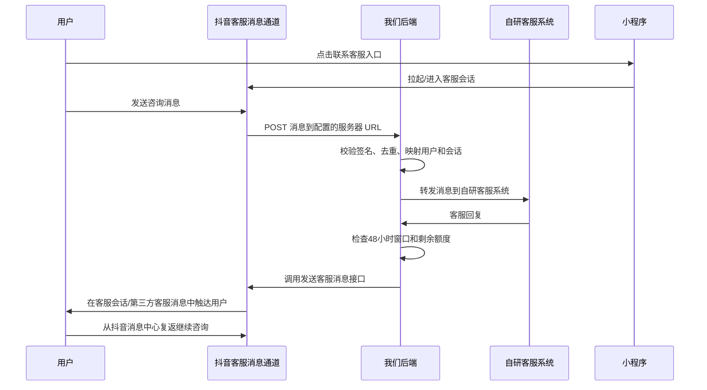

# 自研客服与抖音消息推送客服架构说明

日期：2026-05-01
维护方：Codex
阅读对象：后端 Claude
项目：洪承杂货店抖音小程序

## 背景

我们当前前端已经实现了一个自研客服对话页，路径为：

```text
pages/contact/index/index
```

该页面目前支持：

- 文本消息
- 图片消息
- 视频消息
- 语音条
- 快捷咨询入口
- 客服头像和名称展示位
- 登录后进入客服

但这里存在一个核心架构问题：

**如果客服消息只走我们自己的小程序页面和自建 API，用户退出小程序回到抖音主界面后，我们无法保证继续实时触达用户。**

原因：

- 小程序页面退出后，前端 WebSocket / 轮询不可依赖。
- 自建后端只能保存未读消息，等待用户下次进入小程序后拉取。
- 自建系统没有权限直接把普通客服消息推送到抖音「消息」入口。

## 官方反馈结论

抖音官方说明：如果接入「消息推送客服」，则可以通过抖音客服消息链路实现自研客服系统的消息转发。

关键点：

1. 开发者在开放平台配置服务器 URL。
2. 用户在客服会话中发送消息后，抖音服务器会把消息 POST 到我们配置的后端 URL。
3. 后端把消息转发到我们自己的客服系统。
4. 客服回复后，后端调用抖音「发送客服消息接口」回复用户。
5. 用户离开小程序后，可以在抖音 App「消息」里的「第三方客服消息」入口找回历史会话并继续沟通。

因此，正确理解是：

```text
纯自研客服页 != 可离线推送
自研客服系统 + 抖音消息推送客服通道 = 可通过抖音消息中心复返和触达
```

## 三种客服模式对比

| 模式 | 说明 | 用户退出后触达 | 是否接现有客服系统 | 审核稳定性 |
|---|---|---:|---:|---:|
| self_hosted | 完全自建小程序聊天页和后端 API | 弱，只能下次打开拉未读 | 强 | 中等，需要解释合规 |
| douyin_message_push | 抖音消息推送客服 + 自研客服系统 | 强，可走第三方客服消息入口 | 强 | 较高 |
| douyin_im | 抖音官方 IM 客服 | 强，平台原生会话 | 弱，客服在抖音后台处理 | 最高 |

建议优先级：

```text
douyin_message_push > douyin_im > self_hosted
```

其中 `self_hosted` 只建议作为开发 mock、兜底页面或客服前置页，不建议作为最终唯一客服通道。

## 推荐目标架构



## 后端必须实现的能力

### 1. 消息推送回调入口

需要提供稳定公网 HTTPS URL，例如：

```text
POST /douyin/customer-service/webhook
GET  /douyin/customer-service/webhook
```

用途：

- 接收抖音服务器推送的用户消息。
- 处理抖音服务器的 URL 验证请求。
- 支持 JSON / XML，具体按最终开放平台配置为准。

### 2. 签名校验

后端必须校验请求确实来自抖音平台。

需要处理：

- `signature`
- `timestamp`
- `nonce`
- 后台配置的 `Token`

禁止未校验签名直接入库或转发客服系统。

### 3. 消息去重

后端需要按消息唯一标识去重。

建议：

```text
dedup_key = platform + app_id + open_id + msg_id
```

如果官方 payload 没有稳定 `msg_id`，则使用：

```text
hash(app_id + open_id + create_time + msg_type + content/media_id)
```

### 4. 用户与会话映射

需要把抖音侧用户标识映射到我们客服系统会话。

建议表：

```text
customer_service_sessions
- id
- app_id
- open_id
- union_id nullable
- user_id nullable
- source_scene
- last_user_message_at
- reply_window_expires_at
- reply_quota_remaining
- status
- created_at
- updated_at
```

注意：

- 不应强依赖用户昵称和头像。
- 用户可能拒绝头像昵称授权。
- 客服识别应优先使用内部用户 ID / open_id 映射。

### 5. 48 小时 / 5 条回复额度控制

官方反馈中的限制：

```text
用户发送消息后，48小时内最多回复5条客服消息。
```

后端需要在每次用户发消息时刷新窗口：

```text
reply_window_expires_at = user_message_time + 48h
reply_quota_remaining = 5
```

每次客服通过抖音发送接口成功回复后：

```text
reply_quota_remaining -= 1
```

发送前必须检查：

```text
now <= reply_window_expires_at
reply_quota_remaining > 0
```

超出限制时：

- 不再调用抖音客服消息发送接口。
- 在客服后台提示坐席：用户回复窗口已失效，需要等待用户再次发起咨询。
- 不要用订阅消息或其他方式规避客服消息限制。

### 6. 消息类型支持

后端至少需要支持：

- text
- image

如果官方客服消息发送接口不支持 video / voice，则前端的语音条和视频只能作为自研页面能力，不能承诺在抖音第三方客服消息中完整可用。

需要后端确认最终能力边界：

| 类型 | 小程序自研页 | 抖音消息推送客服 |
|---|---:|---:|
| text | 支持 | 待确认，通常支持 |
| image | 支持 | 待确认，通常支持 |
| video | 支持 | 待确认 |
| voice | 支持 | 待确认 |

### 7. 自研客服系统转发

后端需要把抖音消息转换成现有客服系统的内部消息模型。

建议统一内部消息结构：

```ts
interface CustomerServiceMessage {
  id: string;
  channel: 'douyin_message_push';
  sessionId: string;
  senderRole: 'user' | 'agent' | 'system';
  senderOpenId?: string;
  agentId?: string;
  type: 'text' | 'image' | 'voice' | 'video';
  content?: string;
  mediaUrl?: string;
  thumbUrl?: string;
  duration?: number;
  createdAt: string;
  platformRawPayload?: unknown;
}
```

### 8. 错误处理与补偿

必须记录：

- 抖音回调原始 payload
- 签名校验结果
- 转发客服系统结果
- 调用发送客服消息接口结果
- 失败重试次数
- 最终失败原因

建议增加表：

```text
customer_service_message_delivery_logs
- id
- message_id
- direction inbound/outbound
- provider douyin
- request_payload
- response_payload
- status success/failed/retrying
- error_code
- error_message
- retry_count
- created_at
```

## 前端需要调整的点

当前前端的 `pages/contact/index/index` 不应继续被定义为最终唯一客服通道。

建议新增客服模式配置：

```ts
export const CUSTOMER_SERVICE_MODE = 'douyin_message_push';
```

可选值：

```ts
'douyin_message_push' | 'douyin_im' | 'self_hosted'
```

行为建议：

### douyin_message_push

- 前端保留客服入口按钮。
- 点击后进入抖音允许的客服会话入口。
- 自研客服页只作为说明页、加载页或降级页。
- 重点由后端处理消息转发和客服系统对接。

### douyin_im

- 前端使用：

```ttml
<button open-type="im" data-im-id="{{imId}}">联系客服</button>
```

- 客服在抖音客服服务平台回复。
- 与我们现有客服系统打通能力较弱。

### self_hosted

- 使用当前 `pages/contact/index/index`。
- 只适合开发 mock 或在官方能力不可用时兜底。
- 不承诺用户退出小程序后的实时推送。

## 审核与合规注意

- 不要把客服做成底部 Tab。
- 不要让小程序变成纯聊天导购壳子。
- 客服消息只能用于和用户本次咨询相关的服务回复。
- 禁止用客服消息发送营销、骚扰、虚假夸大、违法内容。
- 不要引导用户添加微信、QQ、手机号等站外私域承接客服。
- 不要要求用户发送密码、远程控制码、身份证、银行卡等敏感信息。
- 需要在隐私说明中明确客服会话、图片、视频、语音等信息的使用目的。

## 对后端 Claude 的结论

请后端优先把客服方案从“纯自研 IM”调整为：

```text
自研客服系统 + 抖音消息推送客服官方通道
```

这能同时满足：

- 使用我们自己的客服系统。
- 用户退出小程序后仍可通过抖音「第三方客服消息」复返。
- 降低审核解释成本。
- 保留后端对会话、工单、客户识别、配置咨询的控制权。

后端下一步优先级：

1. 确认当前小程序是否已开放「消息推送客服」配置入口。
2. 确认消息推送客服最终文档中的回调 payload 和发送接口字段。
3. 设计并实现 `/douyin/customer-service/webhook`。
4. 实现签名校验、消息去重、会话映射。
5. 实现 48 小时 / 5 条额度控制。
6. 打通现有客服系统。
7. 给前端返回最终客服入口模式和必要配置。

## 参考官方文档

- 抖音客服消息能力介绍：`https://developer.open-douyin.com/docs/resource/zh-CN/mini-app/open-capacity/operation/private-account/customer-service/customer-service-introduce`
- 抖音客服消息能力中心：`https://developer.open-douyin.com/capacity-center-page/capacity-detail/7205180847350087741`
- 抖音 IM 客服：`https://developer.open-douyin.com/docs/resource/zh-CN/mini-app/open-capacity/operation/private-account/customer-service/douyin-im-customer-service`
- button 组件 IM 客服能力：`https://developer.open-douyin.com/docs/resource/zh-CN/mini-app/develop/component/open-capacity/button-im-customer-service/`
- 小程序订阅消息能力：`https://developer.open-douyin.com/docs/resource/zh-CN/mini-app/open-capacity/operation/private-account/subscription-message/subscribe-message`
